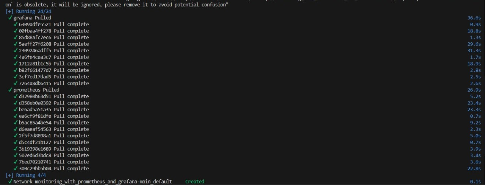
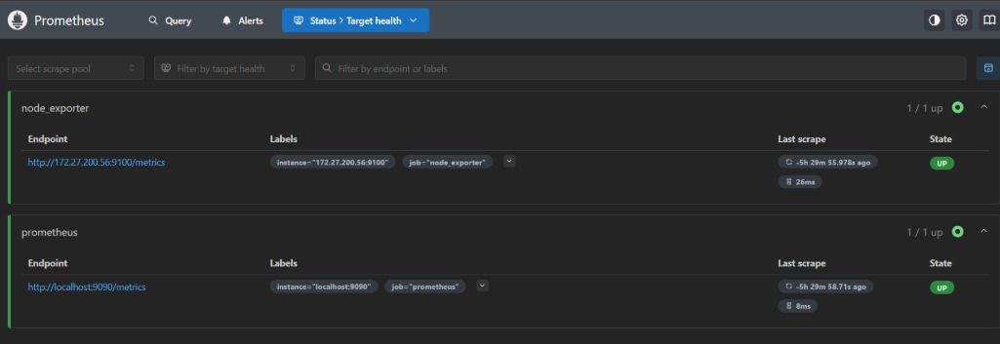
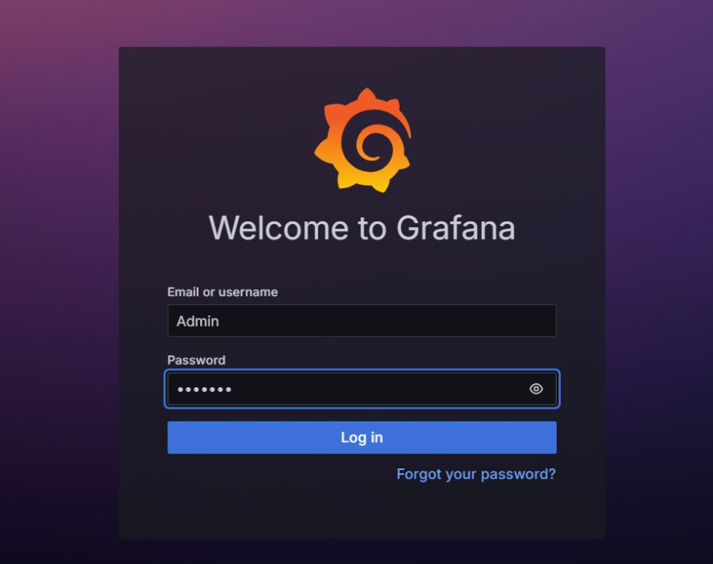
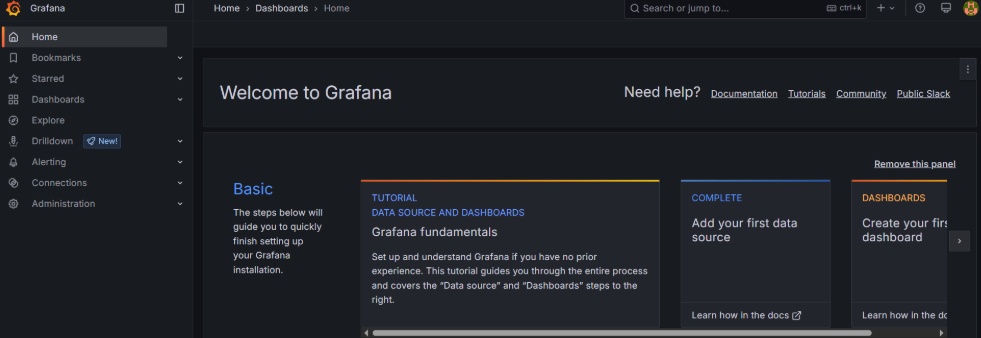
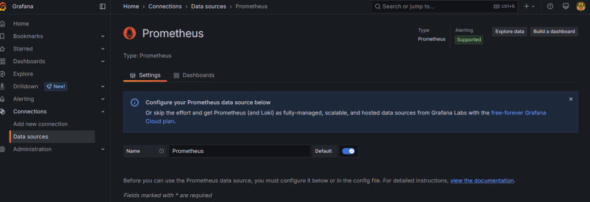
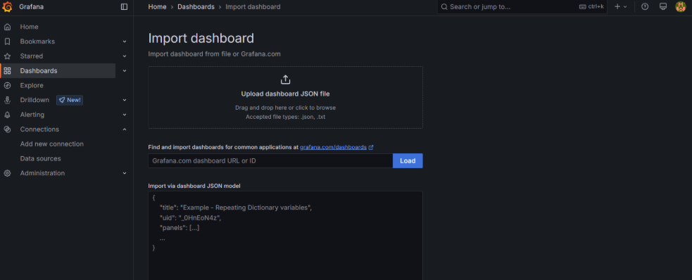

# **Monitoring with Prometheus and Grafana**


## **1. Install Node Exporter on Linux/WSL/Docker**
Node Exporter collects system metrics and exposes them for Prometheus.

### **Steps:**
1. **Download and extract Node Exporter**:
```bash
wget https://github.com/prometheus/node_exporter/releases/download/v1.9.1/node_exporter-1.9.1.linux-amd64.tar.gz
tar xvfz node_exporter-*.*-amd64.tar.gz
cd node_exporter-*.*-amd64
```


2. **Run Node Exporter**:
```bash
./node_exporter
```
- This starts Node Exporter on `http://localhost:9100`.


3. **Verify Metrics**:
- Open in browser: [http://localhost:9100/metrics](http://localhost:9100/metrics)
- Or check via `curl`:
    ```bash
    curl http://localhost:9100/metrics
    curl http://localhost:9100/metrics | grep "node_"
    ```


4. **Note the WSL IP (if needed)**:
- If Prometheus runs outside WSL (e.g., Windows host or Docker), get WSL's IP:
    ```bash
    hostname -I
    ```
- Replace `localhost` with this IP in `prometheus.yml` later.

---

## **2. Start Prometheus & Grafana with Docker Compose**
Prometheus scrapes metrics, and Grafana visualizes them.

### **Steps:**
1. **Create `docker-compose.yml`**:
```yaml
services:
  prometheus:
    image: prom/prometheus
    container_name: prometheus
    command:
      - '--config.file=/etc/prometheus/prometheus.yml'
    ports:
      - 9090:9090
    restart: unless-stopped
    volumes:
      - ./prometheus:/etc/prometheus
      - prom_data:/prometheus
  grafana:
    image: grafana/grafana
    container_name: grafana
    ports:
      - 3000:3000
    restart: unless-stopped
    environment:
      - GF_SECURITY_ADMIN_USER=admin
      - GF_SECURITY_ADMIN_PASSWORD=grafana
    volumes:
      - ./grafana:/etc/grafana/provisioning/datasources
volumes:
  prom_data:
```

2. **Configure `prometheus.yml`**:
```yaml
global:
  scrape_interval: 15s
  scrape_timeout: 10s
  evaluation_interval: 15s

scrape_configs:
- job_name: prometheus
  honor_timestamps: true
  scrape_interval: 15s
  scrape_timeout: 10s
  metrics_path: /metrics
  scheme: http
  static_configs:
  - targets:
    - localhost:9090
  
- job_name: node_exporter
  honor_timestamps: true
  scrape_interval: 15s
  scrape_timeout: 10s
  metrics_path: /metrics
  scheme: http
  static_configs:
  - targets:
    # - localhost:9100 # you migth want to change this to your host IP, if running in node exporter is running in wsl use `hostname -I` to get IP
    - 172.27.200.56:9100 # you migth want to change this to your host IP, if running in node exporter is running in wsl use `hostname -I` to get IP

```

3. **Start Services**:
```bash
docker-compose up -d
```



4. **Verify Prometheus**:
- Open [http://localhost:9090](http://localhost:9090)
- Check targets: **Status → Targets** → Ensure `node-exporter` is **UP**.

---





## **3. Set Up Grafana Dashboard**
Grafana provides visualization for collected metrics.

### **Steps:**
1. **Access Grafana**:
- Open [http://localhost:3000](http://localhost:3000)
- Default login: `admin` / `admin`




2. **Add Prometheus Data Source**:
- **Configuration → Data Sources → Add Prometheus**
- URL: `http://prometheus:9090` (or `http://<Prometheus_IP>:9090` if not in Docker)



3. **Import Node Exporter Dashboard**:
- **Create (+) → Import → Dashboard ID `1860`**  
    (or download [Node Exporter Full Dashboard](https://grafana.com/grafana/dashboards/1860))
- Select Prometheus data source → **Import**.



4. **View Metrics**:
- The dashboard will now display CPU, memory, disk, and network metrics.

---


## **Troubleshooting**
- **Connection Issues?**
- Ensure `node_exporter` is running (`curl http://localhost:9100/metrics`).
- Check `prometheus.yml` uses the correct IP (`hostname -I` in WSL).
- Disable firewalls blocking port `9100` (Windows Defender/WSL).

- **Prometheus Not Scraping?**
- Restart services: `docker-compose restart`.
- Check logs: `docker-compose logs prometheus`.

---

## **Summary**
**Node Exporter** installed and running (`:9100/metrics`).  
**Prometheus** scraping metrics (`:9090/targets`).  
**Grafana** dashboard imported (`:3000`).  

Now you have a full monitoring stack! 


---

#RAW Instructions

# 1 Install prometheus exporter on test linux system/wsl/docker container

read instructions [https://prometheus.io/docs/guides/node-exporter/](https://prometheus.io/docs/guides/node-exporter/)

````bash
wget https://github.com/prometheus/node_exporter/releases/download/v1.9.1/node_exporter-1.9.1.linux-amd64.tar.gz
tar xvfz node_exporter-*.*-amd64.tar.gz
cd node_exporter-*.*-amd64
./node_exporter

echo "visit http://localhost:9100/metrics"
```


after this tutorial check metrics at http://localhost:9100/metrics

or execute

```bash
curl http://localhost:9100/metrics
curl http://localhost:9100/metrics | grep "node_"
```

It will show metrics however, you might need to use actual IP of node exporter, use `hostname -I` to get IP of WSL, and replace `- targets: <actual ip of WSL/node_exporter>` in prometheus.yml

# 2 Start prometheus and grafana using docker compose
now execute `docker-compose up -d`

check prometheus data collection database server
[localhost:9090](localhost:9090)

go to Prometheus >> status >> targets to view status of targets. If status is UP, you can continue with grafana.


View grafana dashboard at 
[localhost:3000](localhost:3000)

follow 
+ >> New Dashboard,

you can create your own dashboard, however, it is easier to import from existing templates,
>> import dashboard >> Discard

visit grafana.com/dashboards for available templates,
but for node exporter use template at [1860-node-exporter-full/](https://grafana.com/grafana/dashboards/1860-node-exporter-full/)

>> download JSON, copy it and add it on previous pannel `JSON model`.
>> Load,

> Observe shown metrics.
